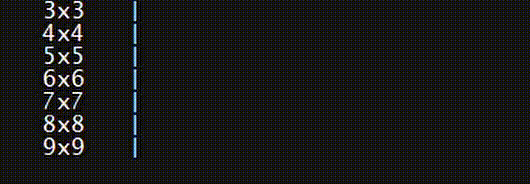

# CLI-Cursor-UI
A demo project (Tic-Tac-Toe) for a keyboard navigation based command-line interface. (for Windows)



## Download and Compilation
### Prerequisites:
- git
- gcc
- make

Clone the repository and run the makefile:
```shell
git clone https://github.com/ThomasWaytec/CLI-Cursor-UI.git
cd ./CLI-Cursor-UI
make
```

## Usage
Type in ```./cursorui``` to run the file.
